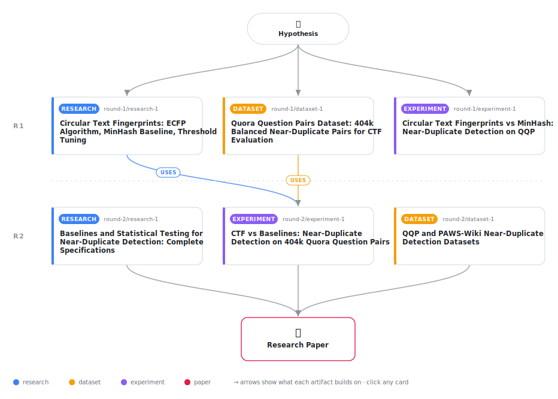

# Circular Text Fingerprints: Evaluating ECFP-Inspired Neighborhood Hashing for Near-Duplicate Short-Text Detection

<div align="center">

<a href="https://cdn.jsdelivr.net/gh/AMGrobelnik/ai-invention-2cec91-circular-text-fingerprints-evaluating-ec@main/workflow.svg">
<picture>
  <source media="(prefers-color-scheme: dark)" srcset="workflow-dark.svg">
  
</picture>
</a>

<sub>🖱️ <b><a href="https://cdn.jsdelivr.net/gh/AMGrobelnik/ai-invention-2cec91-circular-text-fingerprints-evaluating-ec@main/workflow.svg">Open the interactive diagram</a></b> — every card links to its artifact folder.</sub>

</div>

> **TL;DR** — We evaluate Circular Text Fingerprints (CTF), adapting Extended Connectivity Fingerprints from cheminformatics to near-duplicate short-text detection. On 162,415 Quora Question Pairs test pairs, character 4-gram Jaccard achieves the best performance (F1=0.6557) while CTF (R=3) achieves F1=0.6422, performing significantly below the baseline (McNemar p<0.001, 95% CI: [−0.0150, −0.0120]). CTF trades precision for recall but does not achieve higher F1. The negative result reveals that iterative neighborhood hashing does not improve text similarity estimation despite success in cheminformatics, likely because text similarity depends on global structure rather than local context alone. We establish a replicable evaluation protocol with proper baseline tuning, stratified analysis, and rigorous statistical testing, correcting methodological errors from the prior iteration.

<details>
<summary>Full hypothesis</summary>

Applying iterative neighborhood hashing — adapted from Extended Connectivity Fingerprints (ECFP) in cheminformatics — to text tokens does NOT outperform well-tuned character n-gram baselines for near-duplicate detection on question-length texts. On the Quora Question Pairs benchmark (n=162,415 test pairs), character 4-gram Jaccard achieves F1=0.6557 while CTF (R=3) achieves F1=0.6422, a statistically significant underperformance (McNemar p<0.001, bootstrap 95% CI on difference: [-0.015, -0.012]). CTF trades precision for recall (90.6% vs. 89.6% recall; 49.7% vs. 51.7% precision), making it unsuitable for high-precision applications but potentially acceptable for high-recall settings. CTF underperforms character 4-grams across all text-length strata (short ≤6 words: -0.002 F1; medium 7–15 words: -0.010 F1; long 16+ words: -0.052 F1), contradicting the original prediction that iterative context propagation would dominate on short texts where n-grams are sparsest. The likely mechanism is feature explosion without discrimination: for a 10-word question at R=3, CTF generates up to 40 features whose union grows faster than their intersection, reducing Jaccard discriminability (optimal threshold τ=0.05 vs. 0.18 for char 4-grams). A formal open question remains: whether CTF features at radius R are empirically equivalent to (2R+1)-gram word shingling — if 7-gram Jaccard ≈ CTF R=3, CTF is a re-derivation rather than a new feature family. The negative transfer finding — that ECFP's success on sparse, branching molecular graphs does not generalize to dense, linear text sequences — is the primary scientific contribution. Generalizability of this negative result requires evaluation on PAWS-Wiki (high lexical-overlap adversarial pairs), where CTF's behavior may differ because PAWS pairs share nearly identical word sets but differ in structure, potentially exposing the precision-recall trade-off in a distinct regime. The method remains training-free (two parameters: radius R as a structural hyperparameter, threshold τ tuned on held-out data) and O(n·R·window) complexity.

</details>

[](https://cdn.jsdelivr.net/gh/AMGrobelnik/ai-invention-2cec91-circular-text-fingerprints-evaluating-ec@main/paper.pdf) [](https://github.com/AMGrobelnik/ai-invention-2cec91-circular-text-fingerprints-evaluating-ec/tree/main/paper_latex)

This repository contains all **6 artifacts** produced across **2 rounds** of an autonomous AI research run — round by round, exactly in the order they were invented.

## Round 1

| Artifact | Type | Demo | Source | Builds on |
|----------|------|------|--------|-----------|
| **[Circular Text Fingerprints: ECFP Algorithm, MinHash Baseline…](https://github.com/AMGrobelnik/ai-invention-2cec91-circular-text-fingerprints-evaluating-ec/tree/main/round-1/research-1)** | [](https://github.com/AMGrobelnik/ai-invention-2cec91-circular-text-fingerprints-evaluating-ec/tree/main/round-1/research-1) | [](https://github.com/AMGrobelnik/ai-invention-2cec91-circular-text-fingerprints-evaluating-ec/blob/main/round-1/research-1/demo/research_demo.md) | [](https://github.com/AMGrobelnik/ai-invention-2cec91-circular-text-fingerprints-evaluating-ec/tree/main/round-1/research-1/src) | — |
| **[Quora Question Pairs Dataset: 404k Balanced Near-Duplicate P…](https://github.com/AMGrobelnik/ai-invention-2cec91-circular-text-fingerprints-evaluating-ec/tree/main/round-1/dataset-1)** | [](https://github.com/AMGrobelnik/ai-invention-2cec91-circular-text-fingerprints-evaluating-ec/tree/main/round-1/dataset-1) | [](https://colab.research.google.com/github/AMGrobelnik/ai-invention-2cec91-circular-text-fingerprints-evaluating-ec/blob/main/round-1/dataset-1/demo/data_code_demo.ipynb) | [](https://github.com/AMGrobelnik/ai-invention-2cec91-circular-text-fingerprints-evaluating-ec/tree/main/round-1/dataset-1/src) | — |
| **[Circular Text Fingerprints vs MinHash: Near-Duplicate Detect…](https://github.com/AMGrobelnik/ai-invention-2cec91-circular-text-fingerprints-evaluating-ec/tree/main/round-1/experiment-1)** | [](https://github.com/AMGrobelnik/ai-invention-2cec91-circular-text-fingerprints-evaluating-ec/tree/main/round-1/experiment-1) | [](https://colab.research.google.com/github/AMGrobelnik/ai-invention-2cec91-circular-text-fingerprints-evaluating-ec/blob/main/round-1/experiment-1/demo/method_code_demo.ipynb) | [](https://github.com/AMGrobelnik/ai-invention-2cec91-circular-text-fingerprints-evaluating-ec/tree/main/round-1/experiment-1/src) | — |

## Round 2

| Artifact | Type | Demo | Source | Builds on |
|----------|------|------|--------|-----------|
| **[Baselines and Statistical Testing for Near-Duplicate Detecti…](https://github.com/AMGrobelnik/ai-invention-2cec91-circular-text-fingerprints-evaluating-ec/tree/main/round-2/research-1)** | [](https://github.com/AMGrobelnik/ai-invention-2cec91-circular-text-fingerprints-evaluating-ec/tree/main/round-2/research-1) | [](https://github.com/AMGrobelnik/ai-invention-2cec91-circular-text-fingerprints-evaluating-ec/blob/main/round-2/research-1/demo/research_demo.md) | [](https://github.com/AMGrobelnik/ai-invention-2cec91-circular-text-fingerprints-evaluating-ec/tree/main/round-2/research-1/src) | — |
| **[QQP and PAWS-Wiki Near-Duplicate Detection Datasets](https://github.com/AMGrobelnik/ai-invention-2cec91-circular-text-fingerprints-evaluating-ec/tree/main/round-2/dataset-1)** | [](https://github.com/AMGrobelnik/ai-invention-2cec91-circular-text-fingerprints-evaluating-ec/tree/main/round-2/dataset-1) | [](https://colab.research.google.com/github/AMGrobelnik/ai-invention-2cec91-circular-text-fingerprints-evaluating-ec/blob/main/round-2/dataset-1/demo/data_code_demo.ipynb) | [](https://github.com/AMGrobelnik/ai-invention-2cec91-circular-text-fingerprints-evaluating-ec/tree/main/round-2/dataset-1/src) | — |
| **[CTF vs Baselines: Near-Duplicate Detection on 404k Quora Que…](https://github.com/AMGrobelnik/ai-invention-2cec91-circular-text-fingerprints-evaluating-ec/tree/main/round-2/experiment-1)** | [](https://github.com/AMGrobelnik/ai-invention-2cec91-circular-text-fingerprints-evaluating-ec/tree/main/round-2/experiment-1) | [](https://colab.research.google.com/github/AMGrobelnik/ai-invention-2cec91-circular-text-fingerprints-evaluating-ec/blob/main/round-2/experiment-1/demo/method_code_demo.ipynb) | [](https://github.com/AMGrobelnik/ai-invention-2cec91-circular-text-fingerprints-evaluating-ec/tree/main/round-2/experiment-1/src) | <sub><i>uses:</i><br/>[dataset‑1&nbsp;(R1)](https://github.com/AMGrobelnik/ai-invention-2cec91-circular-text-fingerprints-evaluating-ec/tree/main/round-1/dataset-1)<br/>[research‑1&nbsp;(R1)](https://github.com/AMGrobelnik/ai-invention-2cec91-circular-text-fingerprints-evaluating-ec/tree/main/round-1/research-1)</sub> |

## Repository Structure

Artifacts are grouped by the round of invention that produced them. Each
artifact has its own folder with source code and a self-contained demo:

```
.
├── round-1/                         # One folder per round of invention
│   ├── experiment-1/
│   │   ├── README.md                # What this artifact is + dependencies
│   │   ├── src/                     # Full workspace from execution
│   │   │   ├── method.py            # Main implementation
│   │   │   ├── method_out.json      # Full output data
│   │   │   └── ...                  # All execution artifacts
│   │   └── demo/                    # Self-contained demo
│   │       └── method_code_demo.ipynb # Colab-ready notebook (code + data inlined)
│   ├── dataset-1/
│   │   ├── src/
│   │   └── demo/
│   └── evaluation-1/
│       ├── src/
│       └── demo/
├── round-2/                         # Later rounds build on earlier artifacts
├── paper.pdf                        # Research paper
├── paper_latex/                     # LaTeX source files
├── workflow.svg                     # Artifact dependency diagram (this page's header)
└── README.md
```

## Running Notebooks

### Option 1: Google Colab (Recommended)

Click the "Open in Colab" badges above to run notebooks directly in your browser.
No installation required!

### Option 2: Local Jupyter

```bash
# Clone the repo
git clone https://github.com/AMGrobelnik/ai-invention-2cec91-circular-text-fingerprints-evaluating-ec
cd ai-invention-2cec91-circular-text-fingerprints-evaluating-ec

# Install dependencies
pip install jupyter

# Run any artifact's demo notebook
jupyter notebook <artifact_folder>/demo/
```

## Source Code

The original source files are in each artifact's `src/` folder.
These files may have external dependencies - use the demo notebooks for a self-contained experience.

---
*Generated by AI Inventor Pipeline - Automated Research Generation*
